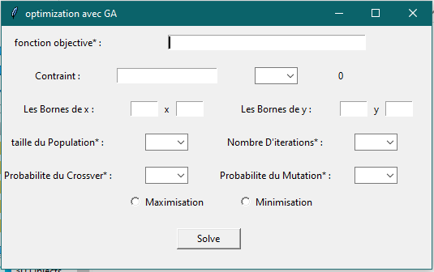
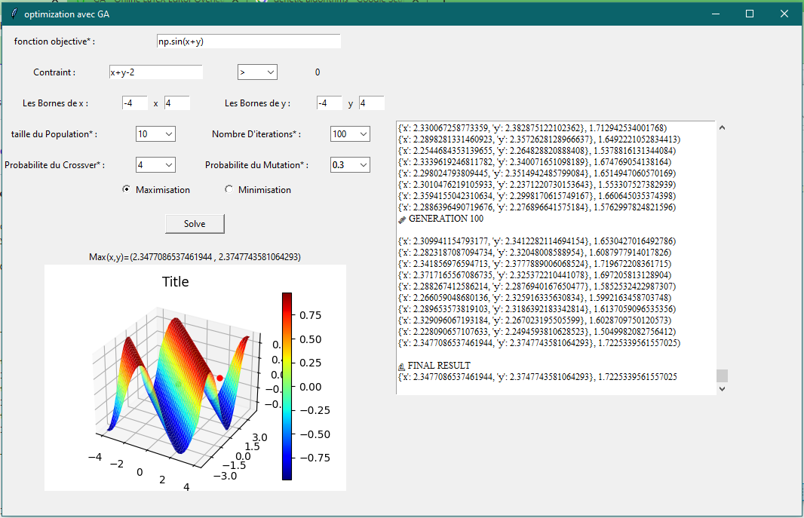

# Constrained_Optimization_With_Genetic_Algorithmes
A python program that uses Genetic Algorithms to Optimize two variables functions with constraints, I made a Tkinter GUI to make the process easy for no programmers

## Genetic Algorithms

The genetic algorithm is a method for solving both constrained and unconstrained optimization problems that is based on natural selection,
the process that drives biological evolution. The genetic algorithm repeatedly modifies a population of individual solutions.

## The Application Summary

* Step1: Main Interface   
  
* Step2: Fill The Required Inputs and Click Solve  

